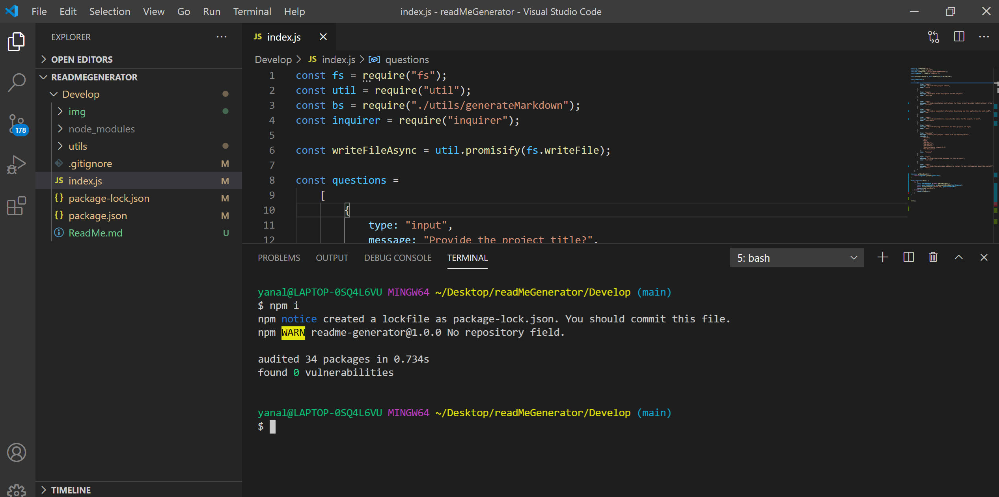

# Work Day Scheduler

# Description:


```
This project is command line application aimed to build a professinal and an easy way to generate a ReadMe file so that develpors can have more time to focus on the real work.
We followed the client requirement to the letter and listed all the passed test cases.
```

# User Story

```
AS A developer
I WANT a README generator
SO THAT can quickly create a professional README for a new project
```

# Acceptance Criteria

```
GIVEN a command-line application that accepts user input
WHEN I am prompted for information about my application repository 
THEN a quality, professional README.md is generated with the title of your project and sections entitled Description, Table of Contents, Installation, Usage, License, Contributing, Tests, and Questions (pass)
WHEN I enter my project title
THEN this is displayed as the title of the README (pass)
WHEN I enter a description, installation instructions, usage information, contribution guidelines, and test instructions
THEN this information is added to the sections of the README entitled Description, Installation, Usage, Contributing, and Tests (pass)
WHEN I choose a license for my application from a list of options
THEN a badge for that license is added hear the top of the README and a notice is added to the section of the README entitled License that explains which license the application is covered under (pass)
WHEN I enter my GitHub username
THEN this is added to the section of the README entitled Questions, with a link to my GitHub profile (pass)
WHEN I enter my email address
THEN this is added to the section of the README entitled Questions, with instructions on how to reach me with additional questions (pass)
WHEN I click on the links in the Table of Contents
THEN I am taken to the corresponding section of the README (pass)
```
## Installation:
start with npm i to initialize by downloading all the dependencies listed package.json file.

    
## Usage:
The application is best use when the customer answers the prompt questions accurately.
    
## Contributing:
none.
    
## Tests:
1- Start by loading the npm i dependencies list in the package.json file.


2- Then to prompt the user run the main index.js on node.


3- Answering the prompt quesitons accurately should provide the expected result:

    
## License:
    Please visit us at the following for more information with regrads the license.
    
-[License](https://opensource.org/licenses/ISC)
    
## Questions:
    For more information about this project, please visit the correponding GitHub repository
    at the following link:
    
- [GitHub Profile](https://github.com/JordanNaei)
    
For additional information and questions, please do not hesitate to reach me via email at:
    JordanNaei.Engineer@gmail.com.
    